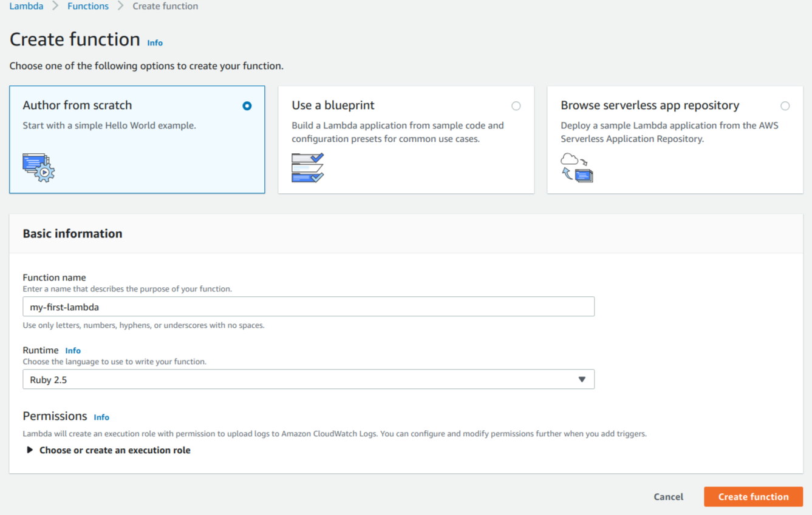
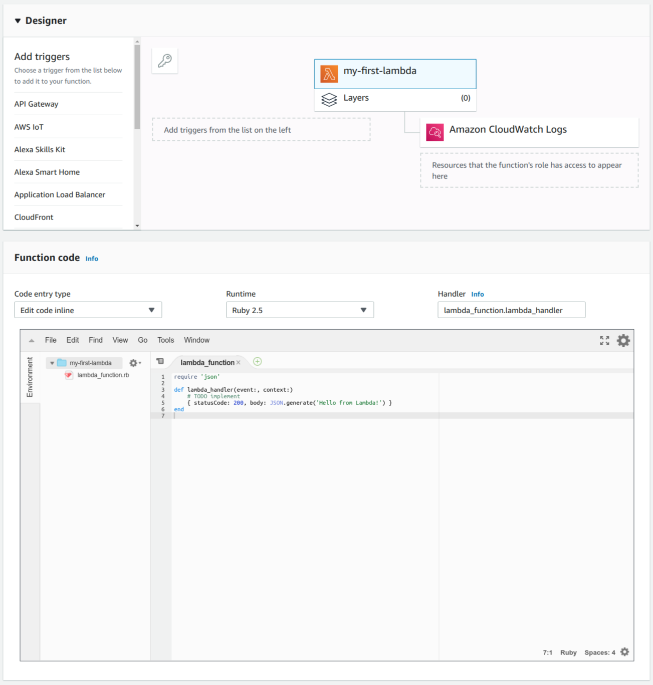
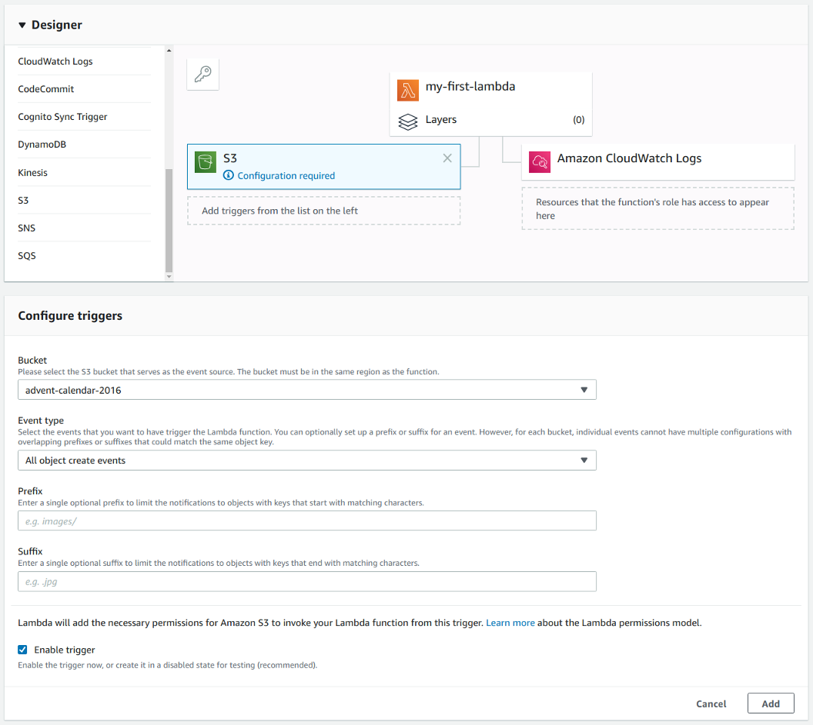
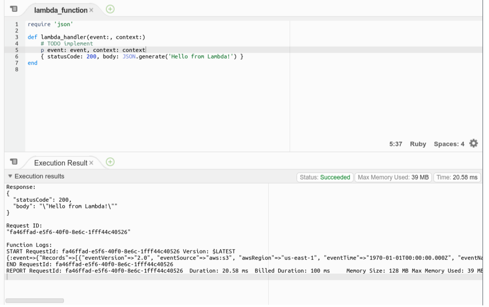
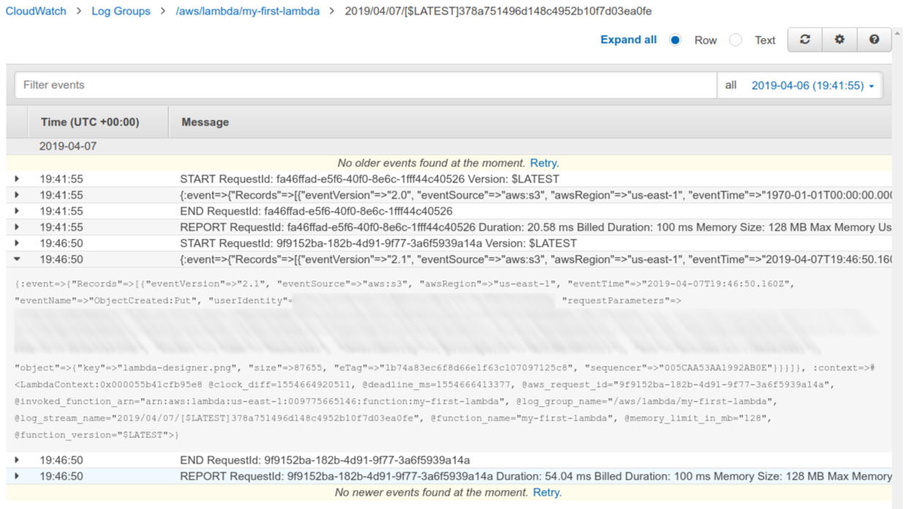
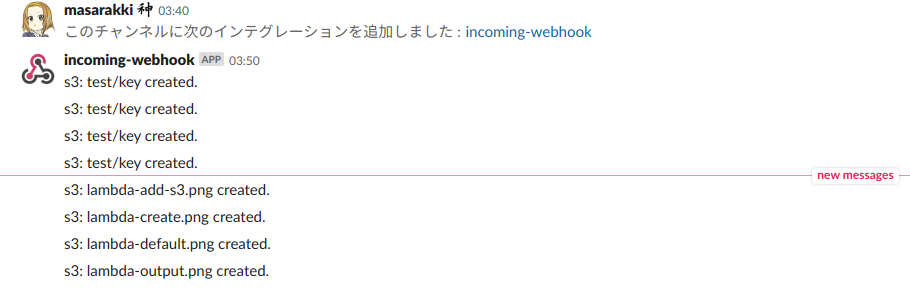

# 初めてのLambdaプログラミング

まずはシンプルに、[AWSのコンソール](https://console.aws.amazon.com/lambda) から初めてのLambdaプログラミングをしてみましょう。
先程のサムネイルを作るプログラムを作りたいのですが、まずは標準ライブラリだけでできる内容を例にしたいと思います。
**S3にファイルが追加されたら指定されたURLにPOSTするプログラム** を作ってみましょう。
つまりWebhookですね。

Create function ボタンを押し、スクラッチから作る(Author from scratch) を選びます。
適当な関数名を入力し、 **ランタイムにRuby2.5を選択** します。
Lambdaを実行するロール(Execute Role)は、まだ存在しないので自動作成を選びましょう。
Lambda関数を作成すると、関数の編集ページに遷移します。



編集ページの下の方には、ロール設定やネットワーク設定などの細々した設定メニューがあります。
重要なのは一番上にある **Designer** とその次の **Function code** です。
Designerでは、Lambdaを実行する **トリガー** をGUIで設定することができます。
Function Codeはもちろんコードを書く部分ですね。
そしてもう一つ大事な機能、一番上のグローバルメニューから **関数のテスト** が実行できます。



## トリガーを指定してみる

今回トリガーにするのは **S3にファイルが追加された時** なので、 左のリストからS3を探してクリックします。
Designer画面にS3が追加され、 *Configuration requried* という警告が出ています。
すぐ下にトリガーの編集画面があるので設定していきます。



対象のバケット名、イベントタイプは `All object create events` を選びます。
`Prefix` や `Suffix` も選べるので、例えばPrefixに `/upload/source` を指定することで、 `/upload/source` に追加された画像のサムネイルを `/upload/thumbnail` に出力すると言ったことが可能になります。
設定が終わったら `Add` ボタンを押し、いったんグローバルメニューから `Save` しましょう。

## テストを実行してみる

次にざっとコードを見てみます。
ウィザードで作られた状態では、 `lambda_function.rb` と言うファイルに `lambda_handler` というメソッドが定義されています。
Handler の欄には `lambda_function.lambda_handler` と指定されているので、`ファイル名.メソッド名` が呼ばれるのだろうと推測できます。

メソッド定義を見てみると、 `event` と `context` の引数を取り、 `statusCode` と `body` のハッシュを返していることがわかります。
さて、これをいじっていくのですが、まずこの2つの引数がどんなものなのかわからないと開発しようがありません。
そこでまずテストを実行してみることにします。

Test のボタンを押すと、まずテストイベントを作ります。
プリセットがたくさんあるので、該当しそうなものを探します。
S3に関しては **Amazon S3 Put** と **Amazon S3 Delete** が用意されています。
おそらくPutを選べば良さそうなので、そのまま任意の名前をつけてイベントを作ります。
なお、Lambda開発しているとよくあるのですが、**本当にそのイベントであっているのか** 実際に本物のイベントが飛んでくるまでわかりません。
S3は運良くプリセットがあったのですが、サービスによっては **プリセットが用意されてない** 場合もあります。
**ぶっちゃけLambdaはここが一番難しい** と思います。

あとは普通のRuby開発のように、 `p event:event, context: context` な感じにデバッグ出力を入れて実行してみましょう。
Execution Result にログ出力されているのが見つかると思います。



## 本当にそれでいいの・・・?

イベント、本当にわからない。
やっぱりもうこの段階から **本物のイベント** を動かしたほうが良さそうな気がします。
実際に選んだS3にファイルを置いてみましょう。
どこにログが出力されるかも、Designerをみればわかります。
**Amazon CloudWatch Logs** ですね。

デプロイごと(Saveを押すごと)にログがわけられているので、最新のログを探します。
その中から本物のログ出力を見つけます。
実物のバケット名が入っていたらおそらくそれです。
比べてみると、**Amazon S3 Put** と同じ形式なのでそのままで大丈夫なことがわかりました。
何なら本物のイベントでテストのJSONを書き換えても良いかもしれません。



## コードをいじる

`event` と `context` が分かったので後はみんな大好き普通のRubyです。

```
require 'json'
require 'uri'
require 'net/http'

def lambda_funciton(event:, context:)
  event['Records'].each do |record|
    key = record['s3']['object']['key']
    uri = URI(ENV['WEBHOOK_URL'])
    payload = JSON.generate(text: "s3: #{key} created.")
    Net::HTTP.post_form(uri, payload: payload)
  end
  {statusCode: 200, body: ''}
end
```

テストを実行したり実際にファイルをアップロードしたりしてみましょう。
環境変数の設定は Function code の下にあります。



上手く動きました!!
完成したコードは[samples/first-lambda](https://github.com/np-complete/TechBookFes06/tree/master/samples/my-first-lambda)にあります。
